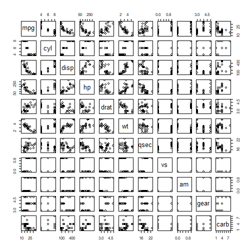

Developing Data Products - Week 4 Course Project.
========================================================
author: Kurt Fitz
date: April 4, 2021
autosize: true

Introduction
========================================================

This Shiny App will display the histogram plot for any of the variables found in the mtcars data set. 


Documentation
========================================================
Here is a summary of the "mtcars" dataset found in the R datasets As you can see, 32 observations on 11 numeric variables.

```
'data.frame':	32 obs. of  11 variables:
 $ mpg : num  21 21 22.8 21.4 18.7 18.1 14.3 24.4 22.8 19.2 ...
 $ cyl : num  6 6 4 6 8 6 8 4 4 6 ...
 $ disp: num  160 160 108 258 360 ...
 $ hp  : num  110 110 93 110 175 105 245 62 95 123 ...
 $ drat: num  3.9 3.9 3.85 3.08 3.15 2.76 3.21 3.69 3.92 3.92 ...
 $ wt  : num  2.62 2.88 2.32 3.21 3.44 ...
 $ qsec: num  16.5 17 18.6 19.4 17 ...
 $ vs  : num  0 0 1 1 0 1 0 1 1 1 ...
 $ am  : num  1 1 1 0 0 0 0 0 0 0 ...
 $ gear: num  4 4 4 3 3 3 3 4 4 4 ...
 $ carb: num  4 4 1 1 2 1 4 2 2 4 ...
```

```r
summary(cars)
```

```
     speed           dist       
 Min.   : 4.0   Min.   :  2.00  
 1st Qu.:12.0   1st Qu.: 26.00  
 Median :15.0   Median : 36.00  
 Mean   :15.4   Mean   : 42.98  
 3rd Qu.:19.0   3rd Qu.: 56.00  
 Max.   :25.0   Max.   :120.00  
```

Summary plot of the mtcars data with each of the relevant variables plotted against each other
========================================================



Links
========================================================
- shiny app: https://zaft.shinyapps.io/Week4_course_project/

- source code: https://github.com/Zaft/datasciencecoursera/tree/master/Developing%20Data%20Products/Week4_course_project
